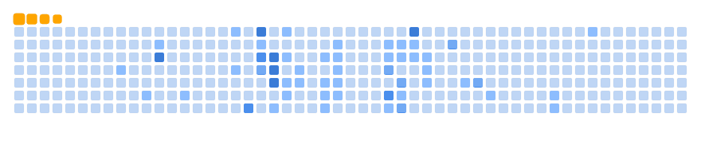

<!--
**biuwuLOK/biuwuLOK** is a ✨ _special_ ✨ repository because its `README.md` (this file) appears on your GitHub profile.

Here are some ideas to get you started:

- 🔭 I’m currently working on ...
- 🌱 I’m currently learning ...
- 👯 I’m looking to collaborate on ...
- 🤔 I’m looking for help with ...
- 💬 Ask me about ...
- 📫 How to reach me: ...
- 😄 Pronouns: ...
- ⚡ Fun fact: ...
-->

<!-- 🔥🔥🔥🔥🔥🔥🔥🔥🔥🔥🔥🔥🔥🔥🔥🔥🔥🔥🔥🔥🔥🔥🔥🔥🔥🔥🔥🔥🔥🔥🔥🔥🔥🔥🔥🔥🔥🔥🔥🔥🔥 -->
<h1 align="center">
  

    
    
    
    
    
    
  

  🔥🔥🔥 Biuwu's little Studio 🔥🔥🔥
  

    
    
    
    
    
    
  

</h1>

  

<h1 align="center">
  
  
</h1>

## About my skills & works

  
<h2>🛠️ Backend & APIs</h2>

    

        
        
        
        
        
        
        
        
        
        
        
        
        
        
        
        
        
        
        
        </td><td></td><td></td><td></td><td></td>
    

  
<h2>💻 Frontend</h2>

    <table>
      <tr>
        <td></td>
        <td></td>
        <td></td>
        <td></td>
        <td></td>
        <td></td>
        <td></td>
        <td></td>
      </tr>
      <tr>
        <td></td>
        <td></td>
        <td></td>
        <td></td><td></td><td></td><td></td><td></td>
      </tr>
    </table>

  
<h2>📱 Mobile & Cross-Platform</h2>

    <table>
      <tr>
        <td></td>
        <td></td>
        <td></td>
        <td></td><td></td><td></td><td></td><td></td>
      </tr>
    </table>

  
<h2>💾 Databases</h2>

    <table>
      <tr>
        <td></td>
        <td></td>
        <td></td><td></td><td></td><td></td><td></td><td></td>
      </tr>
    </table>

  
<h2>🛠️ Tools & Editors</h2>

  

    <td></td>
    <td></td>
    <td></td>
    <td></td>
    <td></td>
    <td></td>
    <td></td>
    <td></td>
    <td></td>
    <td></td>
    <td></td>
    <td></td><td></td><td></td><td></td><td></td>
  

  
<h2>🨠Design & UI/UX</h2>

  

    <table>
      <tr>
        <td></td>
        <td></td>
        <td></td><td></td><td></td><td></td><td></td><td></td>
      </tr>
    </table>
  

  
<h2><0xF0><0x9F><0x97><0x84>️ Operating Systems</h2>

  

    <table>
      <tr>
        <td></td>
        <td></td>
        <td></td>
        <td></td>
        <td></td><td></td><td></td><td></td>
      </tr>
    </table>
  

  
<h2>🌠Web Platforms/CMS</h2>

  

    <table>
      <tr>
        <td></td>
        <td></td>
        <td></td><td></td><td></td><td></td><td></td><td></td>
      </tr>
    </table>
  

# <!-- -->

<!--

-->

